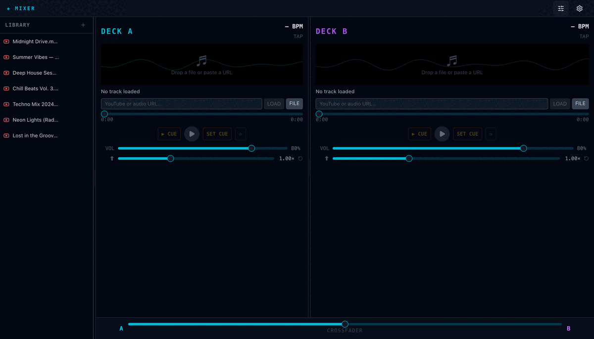

# Waldiez Player

A multi-mode media player and editor with real-time effects, a DJ mixer, mood-driven visualizers, and a timeline editor. Runs in the browser or as a native desktop app via Tauri.



## Modes

### Standard

Full-featured video/audio player with real-time effects, audio visualization, chapter markers, bookmarks, and a media library playlist.

### Mixer

Two-deck DJ interface with a resizable library panel, per-deck controls (volume, pitch, cue points, loop), an equal-power crossfader, and tap-BPM detection. Supports local files, audio URLs, and YouTube (via Piped or iframe fallback).

### Editor

Non-destructive timeline editor with multiple tracks, keyframe animation, transitions (fade, dissolve, wipe, slide, zoom), and export to MP4/WebM/MOV/GIF.

### Reader

Two-panel layout for document and media side-by-side reading.

### Mood modes

Ambient visualizer presets — **Storm**, **Dock**, **Fest**, **Journey**, **Rock**, **Pop**, **Disco**, **Storyteller**, **Audiobook**, **Cinema**, **Presentation**, **Learning** — each with its own color palette, layout, and tracklist panel.

## Tech Stack

- **Frontend**: React 19 + TypeScript + Tailwind CSS v4
- **State**: Zustand
- **Desktop**: Tauri 2.x (Rust)
- **UI primitives**: Radix UI
- **Build**: Vite + Bun
- **Mobile**: Flutter (in progress)

## Development

See [CONTRIBUTING.md](./CONTRIBUTING.md) for the full contribution workflow, pre-commit hooks, manifest rules, and deploy guidance.

### Prerequisites

- [Bun](https://bun.sh) v1.3+
- [Rust](https://rustup.rs) (for Tauri)
- [Tauri prerequisites](https://v2.tauri.app/start/prerequisites/)

### Setup

```bash
bun install

# Web dev server
bun dev

# Desktop (Tauri)
bun dev:tauri
```

### Build

```bash
bun build          # web
bun build:tauri    # desktop .app / .dmg
```

### Tests & quality

```bash
make check         # full gate: types + lint + format + tests + build + rust check
bun test           # unit tests only
bun lint           # eslint + prettier + stylelint
```

## Project Structure

```
waldiez-player/
├── src/
│   ├── components/
│   │   ├── ui/          # Button, Slider, Tooltip, DragHandle
│   │   └── player/      # DJView, EditorView, ReaderView, MoodPlayer, …
│   ├── hooks/           # useDeck, useSplitDrag, useMediaQuery, …
│   ├── stores/          # playerStore, editorStore, readerStore
│   ├── lib/             # mediaSource, pipedPlayer, utils
│   └── types/           # player, editor, modes
├── src-tauri/           # Rust / Tauri backend
├── flutter/             # Flutter mobile app
├── scripts/             # Dev tooling (capture_demo.py, wid generators, …)
├── static/cdn/          # CDN preset .wid files
└── docs/demo/           # README demo assets
```

## Keyboard Shortcuts

| Key                    | Action                             |
| ---------------------- | ---------------------------------- |
| `Space`                | Play / Pause                       |
| `←` / `→`              | Seek −5 s / +5 s                   |
| `J` / `K` / `L`        | Rewind / Pause / Forward           |
| `M`                    | Mute / Unmute                      |
| `F`                    | Fullscreen                         |
| `[` / `]`              | Decrease / Increase playback speed |
| `Cmd/Ctrl + Z`         | Undo (editor)                      |
| `Cmd/Ctrl + Shift + Z` | Redo (editor)                      |
| `S`                    | Split clip at playhead (editor)    |
| `Delete`               | Delete selected clip (editor)      |

## CDN Presets (`.wid` files)

Presets bundle a mode + tracklist into a single shareable file.

```bash
# Generate latest-auto.wid from a feed
bun run wid:latest:sample
bun run wid:latest --feed path/to/feed.json --out static/cdn/repo/latest-auto.wid

# Full pipeline (fetch YouTube + validate + publish)
bun run wid:latest:pipeline

# Dry-run report (no write)
bun run wid:latest:report
```

A scheduled GitHub Actions workflow (`.github/workflows/latest-auto-wid.yml`) regenerates `latest-auto.wid` automatically. Requires `YOUTUBE_API_KEY`; optionally `OPENAI_API_KEY` or `ANTHROPIC_API_KEY` for semantic scoring.

## Demo

To regenerate the demo GIF (requires dev server running):

```bash
bun dev &
python scripts/capture_demo.py
```

Output lands in `docs/demo/`.

## License

Apache-2.0 — part of the [Waldiez](https://waldiez.io) ecosystem.
